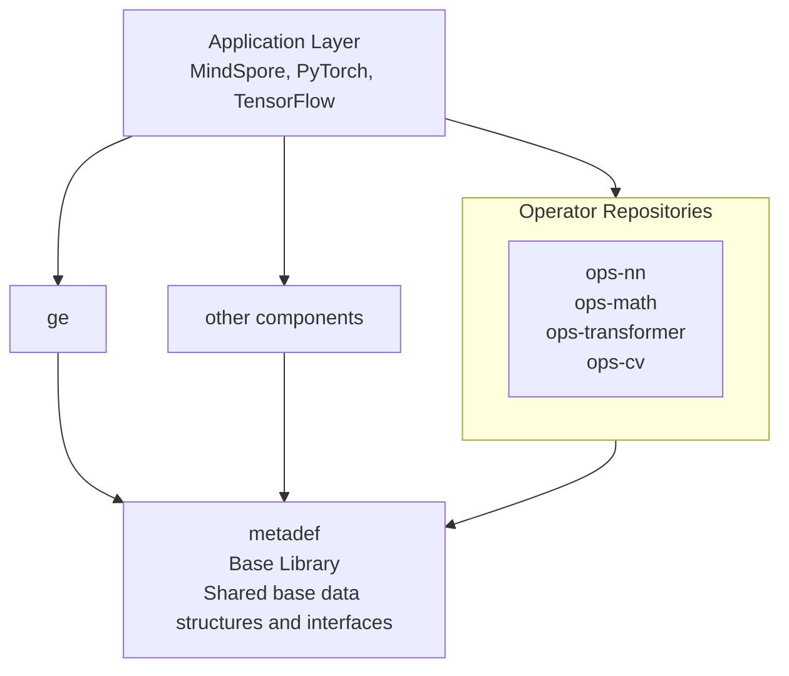
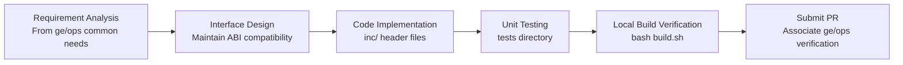

# metadef

## Latest News

- [2025/12/26] The metadef project is first released.

## Overview

`metadef`, namely Ascend Metadata Definition, defines relevant data structures and external interfaces.

### Position in the CANN Architecture

metadef is a foundational component repository of the CANN (Compute Architecture for Neural Networks) platform. It provides shared base data structures and interfaces for upper-layer components such as [ge](https://gitcode.com/cann/ge) (Graph Engine) and operator repositories ([ops-nn](https://gitcode.com/cann/ops-nn), [ops-math](https://gitcode.com/cann/ops-math), [ops-transformer](https://gitcode.com/cann/ops-transformer), [ops-cv](https://gitcode.com/cann/ops-cv)).

### Core Features Provided by metadef

| Feature | Description | Usage Scenario |
|---------|-------------|----------------|
| **Basic Data Types** | Defines basic data structures such as Tensor, Shape, DataType, and Format | Graph compilation, operator development, runtime execution |
| **Operator Registration Interface** | Provides registration mechanisms for operator types, attributes, and Tiling functions | Developing custom operators |
| **Execution Context** | Provides context building interfaces for operator execution | Operator infrastructure development |
| **Attribute/Type Definition** | Defines common tools such as operator attributes and type utilities | Operator type inference, format conversion |

### When to Modify metadef?

Typically, developers do not need to directly modify the metadef repository, because:

1. **ge and ops provide mature upper-layer interfaces**: In most scenarios, developers can complete development through ge or ops interfaces.
2. **ABI compatibility requirements**: Interface changes in metadef must maintain ABI compatibility. Arbitrary modifications may cause other components to malfunction.

**Typical scenarios requiring metadef modifications**:

- **Adding common base types**: When both ge and ops require a new base data type.
- **Extending operator registration capabilities**: When new operator registration features need support.
- **Fixing common interface issues**: When defects are found in base data types or interfaces.
- **Cross-repository collaboration requirements**: When multiple components require a unified interface implementation.

> Note: Before modifying metadef, ensure that you:
>
> 1. Verify the actual need in the ge or ops repository.
> 2. Evaluate the impact on other components.
> 3. Maintain ABI compatibility.
> 4. Thoroughly test dependent components.

## Quick Start

To quickly build this project, visit [Source Code Build](docs/en/build_en.md) to learn how to compile, install, and perform basic verification tests.

## Learning Tutorials

### Developer Guide

If you need to **modify or extend** metadef, follow these steps:

#### Development Process

#### Code Modification Checklist

Before submitting metadef modifications, ensure:

- [ ] The modification originates from real requirements in ge or ops (not personal preference).
- [ ] ABI compatibility of external interfaces is maintained.
- [ ] Corresponding unit tests are added.
- [ ] All tests pass (`bash tests/run_test.sh -u`).
- [ ] Relevant documentation is updated (docs/api/README.md).
- [ ] Commit message follows the Conventional Commits specification.

### Detailed API Reference

For detailed information about all interfaces in this repository, visit [API Reference](docs/api/README.md).

## Related Information

- [Contributing Guide](CONTRIBUTING_en.md)
- [Security Statement](SECURITY_en.md)
- [License](LICENSE)
