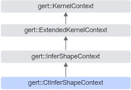

# 简介<a name="ZH-CN_TOPIC_0000002343738457"></a>

CtInferShapeContext继承自InferShapeContext，用于编译期Shape推导，提供编译期使用的接口。

该类主要用于资源类算子，资源类算子分为创建资源的算子和使用资源的算子两类，这两类算子通过传递DT\_RESOURCE句柄来关联资源。句柄信息通过CtInferShapeContext提供的接口在编译期获取。

CtInferShapeContext继承关系图如下：



## 需要包含的头文件<a name="section78885814919"></a>

```
#include <ct_infer_shape_context.h>
```

