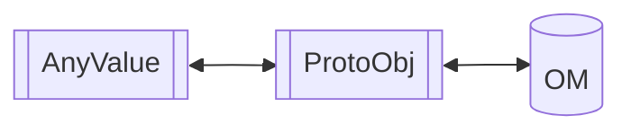

## 语义变更接口

| 接口名      | 原语义          | 新语义          | 备注                                                         |
| ----------- | --------------- | --------------- | ------------------------------------------------------------ |
| GetAllAttrs | GeAttrValue共享 | GeAttrValue拷贝 | 包含AttrUtils下的该方法、OpDesc、TensorDesc等类下的该方法，均产生了语义变化 |
|             |                 |                 |                                                              |
|             |                 |                 |                                                              |
|             |                 |                 |                                                              |
|             |                 |                 |                                                              |
|             |                 |                 |                                                              |

**所谓共享语义和拷贝语义**

例如GetAllAttrs接口，原接口为共享语义，考虑如下接口：

```c++
AttrUtils::SetInt(op_desc, "i", 10);
auto attrs = AttrUtils::GetAllAttrs(op_desc); // attrs有个属性i，值为10
AttrUtils::SetInt(op_desc, "i", 20); // 共享语义：attrs中的属性i的值同步变更为20；拷贝语义：attrs中的i的值不会同步变化
```


### GeAttrValue(AnyValue)

| 接口原型                                  | 使用建议               | 替换接口                                |
| ----------------------------------------- | ---------------------- | --------------------------------------- |
| ValueType GetValueType() const  noexcept; | 不推荐使用（性能无关） | TypeId GetValueTypeId() const noexcept; |
| ValueType                                 | 不推荐使用（性能无关） | TypeId                                  |
|                                           |                        |                                         |
|                                           |                        |                                         |
|                                           |                        |                                         |

## 样例代码

### 比对GeAttrValue的TypeId

原有写法：

```c++
// attr_value 是GeAttrValue的一个实例
auto value_type = attr_value.GetValueType();
switch (value_type) {
  case GeAttrValue::VT_STR:
    // do something...
    break;
  case GeAttrValue::LIST_INT:
    // do something...
    break;
}
```


建议写法：

```c++
// attr_value 是GeAttrValue的一个实例
auto value_type = attr_value.GetValueTypeId();

// 新版本的type_id不是枚举类型，因此用不了switch-case，需要使用if语句判断
if (value_type == GetTypeId<std::string>()) {
    // do something ...
} else if (value_type == GetTypeId<std::vector<int64_t>>()) {
    // do something ...
}
```


##  属性序列化设计

由于属性在内存中使用AnyValue替换protobuf对象保存，属性的序列化也就不再像以前一样可以直接使用protobuf对象赋值：

```c++
// 原model_serialize中图属性序列化的代码
  if (graph->impl_ != nullptr && graph->impl_->attrs_.GetProtoMsg() != nullptr) {
    *graph_proto->mutable_attr() = *graph->impl_->attrs_.GetProtoMsg();
  }
```

我们要保证生成的om/pb文件是兼容的，因此proto定义不会变化，因此需要完成新属性对象与om文件之间的序列化、反序列化



由于属性可保存的数据类型很多，而且长远来看是需要动态扩展的，所以较好的办法是做一套注册机制，允许将每种类型属性的序列化与框架部分分离，便于后续扩展。例如要新增一种属性的数据类型，只要继承`Serializer`，实现一个子类即可：

```c+++
/**
 * 所有的serializer都应该是无状态的、可并发调用的，全局仅构造一份，后续多线程并发调用
 */
class GeIrAttrSerializer {
 public:
  virtual graphStatus Serialize(const AnyValue &av, proto::AttrDef &def) = 0;
  virtual graphStatus Deserialize(const proto::AttrDef &def, AnyValue &av) = 0;
  virtual ~GeIrAttrSerializer() = default;
};
```

从上述接口可知，`AttrDef`作为protobuf的数据类型，出现在了Serializer的接口中，我们知道protobuf的API均不保证ABI兼容，因此Serializers与ge_ir定义**必须做同步编译**，而且Serializers、Serializers调用者（当前来看是libgraph中的serialize模块）、ge_ir对应的pb.cc/.h三者**必须使用同一个protobuf版本编译，而且执行时链接同一份protobuf代码段**。从当前来看，可以将serializers、ge_ir编译出的pb.cc/.h、Serializer调用者均包在libgraph中，可满足上述要求。后续模块演进时，不可破坏此约定，否则在边界处需要去除protobuf对ABI不兼容的影响。

新增一种属性的数据类型后，实现该类，并通过宏做如下方法的注册：

```c++
class TypeAGeIrAttrSerializer : public GeIrAttrSerializer {
  // 属性序列化、反序列化的实现  
};

REG_GEIR_ATTR_SERIALIZER(TypeAGeIrAttrSerializer, GetTypeId<int64_t>, "protobuf-type");
```

### 反射机制

* value_case()方式
* GetTypeId<>()方式
* 


### list属性处理方式

查看属性部分的proto定义，整体分为两类属性，分别时单个类型的属性与list类型属性：

```protobuf
message AttrDef
{
    message ListValue
    {
        enum ListValueType{
          VT_LIST_NONE = 0;
          VT_LIST_STRING = 1;
          VT_LIST_INT = 2;
          VT_LIST_FLOAT = 3;
          VT_LIST_BOOL = 4;
          VT_LIST_BYTES = 5;
          VT_LIST_TENSOR_DESC = 6;
          VT_LIST_TENSOR = 7;
          VT_LIST_GRAPH = 8;
          VT_LIST_NAMED_ATTRS = 9;
          VT_LIST_DATA_TYPE = 10;
        }
        repeated bytes s             = 2;                    // "list(string)"
        repeated int64 i             = 3;  // "list(int)"
        repeated float f             = 4;   // "list(float)"
        repeated bool  b             = 5;  // "list(bool)"
        repeated bytes bt            = 7;
        repeated TensorDescriptor td = 8;
        repeated TensorDef t         = 9;
        repeated GraphDef g          = 10;
	    repeated NamedAttrs na       = 11;
	    repeated int64 dt            = 12; // list ge::DataType

	    ListValueType val_type       = 20;
    }

    message ListListInt{
        message ListInt{
            repeated int64 list_i             = 1; // list int
        }
        repeated ListInt list_list_i             = 1; // list list int
    }

    message ListListFloat{
        message ListFloat{
            repeated float list_f             = 1; // list float
        }
        repeated ListFloat list_list_f             = 1; // list list float
    }

    oneof value
    {
        bytes            s    = 2;  // "string"
        int64            i    = 3;  // "int"
        float            f    = 4;  // "float"
        bool             b    = 5;  // "bool"
        bytes            bt   = 7;
        ListValue        list = 1;   // any "list(...)"
        NamedAttrs       func = 10;  // Used to support attr nesting
        TensorDescriptor td   = 11;  // GeTensorDesc type
        TensorDef        t    = 12;  // GeTensor type
        GraphDef         g    = 13;  // Graph type
        ListListInt      list_list_int  = 14;  // List List Int type
        int64            dt   = 15; // ge::DataType
        ListListFloat    list_list_float  = 16;  // List List Float type
    }
}
```

### 性能

在GeAttrValue(AnyValue)替换原有实现后，性能方面的考虑主要包括以下几点：

1. **内存分配优化**
   - AnyValue采用小对象优化(SOO)技术，对于小尺寸数据类型（如基本类型、短字符串）直接在对象内部存储，避免堆内存分配
   - 对于复杂类型，使用智能指针管理，支持移动语义，减少不必要的拷贝

2. **访问性能**
   - 类型判断使用TypeId系统，相比原有的枚举类型判断，性能开销相近但支持更多类型
   - 值的访问通过模板特化实现，编译器可以高度优化

3. **序列化性能**
   - 采用注册式序列化器架构，每种类型有专门的序列化实现，避免运行时类型检查
   - 批量操作属性时，建议预分配足够的空间以减少内存重分配

4. **推荐使用场景**
   - 高频属性访问场景建议使用TypeId直接判断类型
   - 大量属性操作时建议批量处理
   - 避免在热路径中频繁创建/销毁属性对象

### 兼容性

#### 向前兼容性（Forward Compatibility）

1. **数据格式兼容**
   - 新的AnyValue实现保持与原有protobuf属性定义的二进制格式兼容
   - 旧版本生成的模型文件(OM/PB)可以正常加载和解析
   - 新增的属性类型通过扩展机制支持，不影响已有格式

2. **API层面兼容**
   - 原有基于共享语义的接口已明确标记为已废弃，提供过渡期
   - 新增拷贝语义接口，确保数据安全性
   - 提供迁移指南帮助用户逐步过渡到新接口

#### 向后兼容性（Backward Compatibility）

1. **版本兼容策略**
   - 采用渐进式废弃策略，旧接口保留至少2个版本周期
   - 在编译期给出废弃警告，给予用户充分时间迁移
   - 关键接口通过宏控制实现向后兼容

2. **运行期兼容**
   - 新实现支持动态加载旧版本的算子库
   - 运算符注册框架同时支持V1和V2版本API
   - 序列化/反序列化实现保持与旧格式的互操作性

#### 二进制兼容（ABI Compatibility）

1. **关键约束**
   - Serializers、ge_ir的pb.cc/.h、Serializer调用者必须使用相同的protobuf版本编译
   - 运行时链接同一份protobuf代码段以保证ABI兼容
   - 所有序列化器都必须是无状态的，支持多线程并发调用

2. **模块组织建议**
   - 将serializers、ge_ir编译出的pb.cc/.h、Serializer调用者打包在libgraph中
   - 后续模块演进时需保持此约定，避免在边界处破坏ABI兼容性

#### 迁移建议

1. **代码迁移路径**
   - 优先替换性能敏感路径中的属性操作
   - 逐步替换类型判断逻辑（从枚举方式转向TypeId方式）
   - 测试验证新实现的行为一致性后再全面切换

2. **注意事项**
   - 迁移期间注意共享语义与拷贝语义的行为差异
   - 确保单元测试覆盖原有的共享语义场景
   - 关注内存使用模式的变化，特别是小对象优化带来的影响
