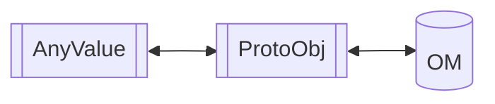

## Semantic Change Interfaces

| Interface Name | Original Semantic | New Semantic | Note |
| -- | -- | -- | -- |
| GetAllAttrs | GeAttrValue sharing | GeAttrValue copying | Includes this method under AttrUtils, and this method under OpDesc, TensorDesc classes, all have semantic changes |

**Sharing Semantic and Copying Semantic**

For example, the GetAllAttrs interface originally had sharing semantic. Consider the following interface:

```c++
AttrUtils::SetInt(op_desc, "i", 10);
auto attrs = AttrUtils::GetAllAttrs(op_desc); // attrs has an attribute i with value 10
AttrUtils::SetInt(op_desc, "i", 20); // Sharing semantic: the value of attribute i in attrs synchronously changes to 20; Copying semantic: the value of i in attrs does not change synchronously
```

### GeAttrValue(AnyValue)

| Interface Prototype | Usage Recommendation | Replacement Interface |
| -- | -- | -- |
| ValueType GetValueType() const noexcept; | Not recommended (performance unrelated) | TypeId GetValueTypeId() const noexcept; |
| ValueType | Not recommended (performance unrelated) | TypeId |

## Sample Code

### Comparing GeAttrValue TypeId

Original approach:

```c++
// attr_value is an instance of GeAttrValue
auto value_type = attr_value.GetValueType();
switch (value_type) {
  case GeAttrValue::VT_STR:
    // do something...
    break;
  case GeAttrValue::LIST_INT:
    // do something...
    break;
}
```

Recommended approach:

```c++
// attr_value is an instance of GeAttrValue
auto value_type = attr_value.GetValueTypeId();

// The new version type_id is not an enum type, so switch-case cannot be used. Use if statements for judgment.
if (value_type == GetTypeId<std::string>()) {
    // do something ...
} else if (value_type == GetTypeId<std::vector<int64_t>>()) {
    // do something ...
}
```

## Attribute Serialization Design

Since attributes use AnyValue instead of protobuf objects for storage in memory, attribute serialization is no longer as simple as directly using protobuf object assignment:

```c++
// Original code for graph attribute serialization in model_serialize
  if (graph->impl_ != nullptr && graph->impl_->attrs_.GetProtoMsg() != nullptr) {
    *graph_proto->mutable_attr() = *graph->impl_->attrs_.GetProtoMsg();
  }
```

We must ensure that the generated OM/PB files are compatible, so the proto definition will not change. Therefore, we need to implement serialization and deserialization between the new attribute objects and OM files.



Since attributes can store many data types and need dynamic extension in the long term, a better approach is to implement a registration mechanism that allows the serialization of each attribute type to be separated from the framework part, facilitating future extension. For example, to add a new attribute data type, just inherit from `Serializer` and implement a subclass:

```c++
/**
 * All serializers should be stateless and concurrently callable. Only one instance is constructed globally, and multiple threads call it concurrently afterward.
 */
class GeIrAttrSerializer {
 public:
  virtual graphStatus Serialize(const AnyValue &av, proto::AttrDef &def) = 0;
  virtual graphStatus Deserialize(const proto::AttrDef &def, AnyValue &av) = 0;
  virtual ~GeIrAttrSerializer() = default;
};
```

From the above interface, `AttrDef` as a protobuf data type appears in the Serializer interface. We know that protobuf APIs do not guarantee ABI compatibility, so Serializers and ge_ir definition **must be compiled synchronously**, and Serializers, Serializer callers (currently the serialize module in libgraph), and the pb.cc/.h corresponding to ge_ir **must use the same protobuf version for compilation and link the same protobuf code segment at runtime**. Currently, serializers, the pb.cc/.h compiled from ge_ir, and Serializer callers can all be packaged in libgraph to meet the above requirements. During subsequent module evolution, this agreement must not be broken, otherwise the impact of protobuf on ABI incompatibility must be removed at the boundary.

After adding a new attribute data type, implement that class and register through the macro as follows:

```c++
class TypeAGeIrAttrSerializer : public GeIrAttrSerializer {
  // Implementation of attribute serialization and deserialization
};

REG_GEIR_ATTR_SERIALIZER(TypeAGeIrAttrSerializer, GetTypeId<int64_t>, "protobuf-type");
```

### Reflection Mechanism

* value_case() method
* GetTypeId<>() method

### list Attribute Processing

Looking at the proto definition for the attribute part, attributes are divided into two types: single-type attributes and list-type attributes:

```protobuf
message AttrDef
{
    message ListValue
    {
        enum ListValueType{
          VT_LIST_NONE = 0;
          VT_LIST_STRING = 1;
          VT_LIST_INT = 2;
          VT_LIST_FLOAT = 3;
          VT_LIST_BOOL = 4;
          VT_LIST_BYTES = 5;
          VT_LIST_TENSOR_DESC = 6;
          VT_LIST_TENSOR = 7;
          VT_LIST_GRAPH = 8;
          VT_LIST_NAMED_ATTRS = 9;
          VT_LIST_DATA_TYPE = 10;
        }
        repeated bytes s             = 2;                    // "list(string)"
        repeated int64 i             = 3;  // "list(int)"
        repeated float f             = 4;   // "list(float)"
        repeated bool  b             = 5;  // "list(bool)"
        repeated bytes bt            = 7;
        repeated TensorDescriptor td = 8;
        repeated TensorDef t         = 9;
        repeated GraphDef g          = 10;
        repeated NamedAttrs na       = 11;
        repeated int64 dt            = 12; // list ge::DataType

        ListValueType val_type       = 20;
    }

    message ListListInt{
        message ListInt{
            repeated int64 list_i             = 1; // list int
        }
        repeated ListInt list_list_i             = 1; // list list int
    }

    message ListListFloat{
        message ListFloat{
            repeated float list_f             = 1; // list float
        }
        repeated ListFloat list_list_f             = 1; // list list float
    }

    oneof value
    {
        bytes            s    = 2;  // "string"
        int64            i    = 3;  // "int"
        float            f    = 4;  // "float"
        bool             b    = 5;  // "bool"
        bytes            bt   = 7;
        ListValue        list = 1;   // any "list(...)"
        NamedAttrs       func = 10;  // Used to support attr nesting
        TensorDescriptor td   = 11;  // GeTensorDesc type
        TensorDef        t    = 12;  // GeTensor type
        GraphDef         g    = 13;  // Graph type
        ListListInt      list_list_int  = 14;  // List List Int type
        int64            dt   = 15; // ge::DataType
        ListListFloat    list_list_float  = 16;  // List List Float type
    }
}
```

### Performance

After GeAttrValue(AnyValue) replaces the original implementation, performance considerations include the following:

1. **Memory Allocation Optimization**
   - AnyValue uses Small Object Optimization (SOO) technology. For small data types (such as basic types, short strings), it stores directly within the object to avoid heap memory allocation.
   - For complex types, it uses smart pointers for management and supports move semantics to reduce unnecessary copying.

2. **Access Performance**
   - Type judgment uses the TypeId system, which has similar performance overhead compared to the original enum type judgment but supports more types.
   - Value access is implemented through template specialization, which can be highly optimized by the compiler.

3. **Serialization Performance**
   - Uses a registered serializer architecture where each type has a dedicated serialization implementation, avoiding runtime type checking.
   - For batch attribute operations, it is recommended to pre-allocate sufficient space to reduce memory reallocation.

4. **Recommended Usage Scenarios**
   - For high-frequency attribute access scenarios, use TypeId to directly judge types.
   - For large-scale attribute operations, process in batches.
   - Avoid frequent creation/destruction of attribute objects in hot paths.

### Compatibility

#### Forward Compatibility

1. **Data Format Compatibility**
   - The new AnyValue implementation maintains binary format compatibility with the original protobuf attribute definition.
   - Model files (OM/PB) generated by older versions can be loaded and parsed normally.
   - New attribute types are supported through the extension mechanism without affecting existing formats.

2. **API Level Compatibility**
   - The original interface based on sharing semantic is explicitly marked as deprecated with a transition period.
   - New copying semantic interfaces are added to ensure data safety.
   - Migration guides are provided to help users gradually transition to new interfaces.

#### Backward Compatibility

1. **Version Compatibility Strategy**
   - Uses a progressive deprecation strategy where old interfaces are retained for at least 2 version cycles.
   - Deprecation warnings are issued at compile time to give users sufficient time to migrate.
   - Key interfaces implement backward compatibility through macro control.

2. **Runtime Compatibility**
   - The new implementation supports dynamic loading of older version operator libraries.
   - The operator registration framework supports both V1 and V2 version APIs.
   - Serialization/deserialization implementation maintains interoperability with old formats.

#### ABI Compatibility

1. **Key Constraints**
   - Serializers, ge_ir pb.cc/.h, and Serializer callers must be compiled using the same protobuf version.
   - Runtime links to the same protobuf code segment to ensure ABI compatibility.
   - All serializers must be stateless and support multi-threaded concurrent calls.

2. **Module Organization Recommendations**
   - Package serializers, ge_ir compiled pb.cc/.h, and Serializer callers in libgraph.
   - During subsequent module evolution, maintain this agreement to avoid breaking ABI compatibility at boundaries.

#### Migration Recommendations

1. **Code Migration Path**
   - Prioritize replacing attribute operations in performance-sensitive paths.
   - Gradually replace type judgment logic (from enum approach to TypeId approach).
   - Test and verify behavioral consistency of the new implementation before full migration.

2. **Considerations**
   - During migration, pay attention to behavioral differences between sharing semantic and copying semantic.
   - Ensure unit tests cover original sharing semantic scenarios.
   - Monitor changes in memory usage patterns, especially the impact of small object optimization.
   