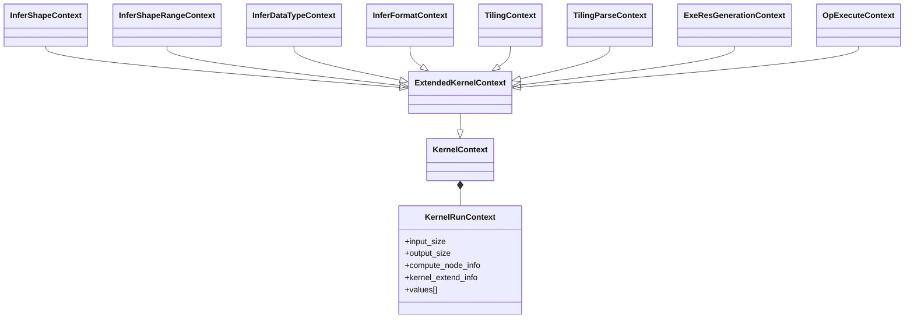
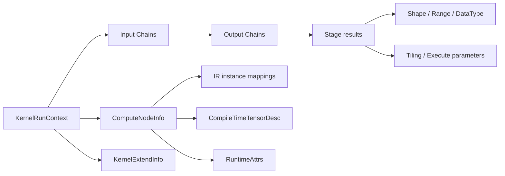
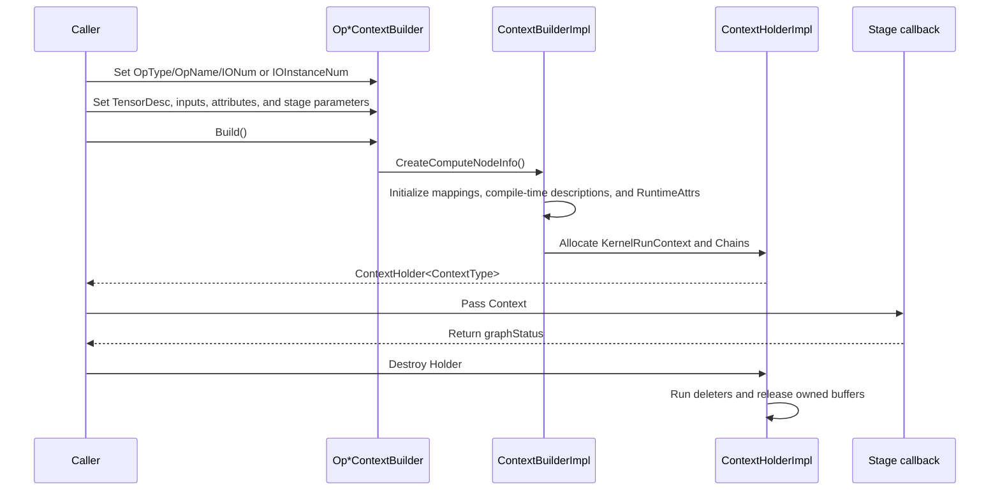
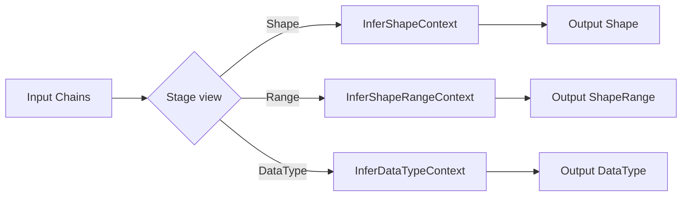
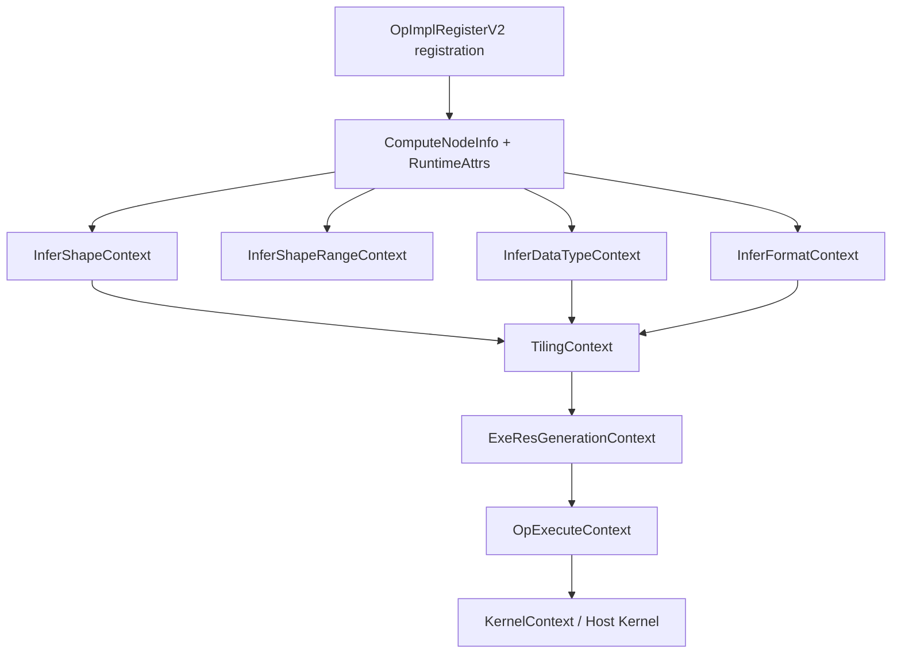

# metadef Context System Design

## 1 Background

### 1.1 Problem Domain

In the CANN graph compilation and operator execution pipeline, an operator is processed by multiple stages: data type inference, shape inference, shape-range inference, format inference, tiling, execution-resource generation, and host-side execution. Each stage needs to access the node's inputs, outputs, attributes, IR prototypes, and instantiated information, but the objects and permissions differ between stages.

If every stage defined an independent parameter structure, operator registration, the GE compiler, and the execution graph would have to maintain multiple I/O-indexing, attribute-encoding, and memory-lifetime protocols. The metadef Context system consolidates these common parts into a stable `KernelRunContext`, and provides typed views through `KernelContext`, `ExtendedKernelContext`, and stage-specific Context classes. Operator implementations depend only on the public Context interfaces and do not need to know GE's internal graph objects or the underlying slot layout.

### 1.2 Design Goals

The Context system is designed around the following goals:

- **A unified callback boundary**: callbacks for different stages receive a `ContextType *`, allowing registration and execution components to share one calling convention.
- **Two indexing schemes**: ordinary interfaces use instantiated flat indices; Required, Optional, and Dynamic interfaces use IR prototype indices and relative instance indices.
- **Separation of node metadata and stage data**: `ComputeNodeInfo` describes the operator prototype and instance mapping, while Tensor, Shape, Range, TilingData, and other stage data are passed through Chain slots.
- **Low hot-path overhead**: small values are stored inline and large objects are passed by pointer; Context access is primarily bounds checking, index conversion, and one dereference.
- **Stable layout**: public structures use standard layout, and versioned Tensor objects carry View information in an extension area.

### 1.3 Design Philosophy

The Context design can be summarized as **a stable C-compatible/standard-layout base, typed stage views, and an external ownership protocol**:

- `KernelRunContext` and `AsyncAnyValue` provide only the fixed layout required for cross-module transport; C++ Context views provide stage semantics.
- Ordinary instance indices and IR prototype indices are separate. Dynamic inputs and outputs are mapped through `AnchorInstanceInfo` instead of maintaining a separate mapping in every stage.
- Context does not copy Tensor, Shape, or platform objects. Callers pass pointers through Chain, and a Holder releases only objects for which a deleter has explicitly been installed.
- ABI stability takes precedence over object encapsulation. New stage data should be placed in extension slots or independent extension structures instead of changing the public header layout.

### 1.4 Context Overview

The responsibility of a Context can be summarized as “the same node, different stages, different views”:

| Stage | Context | Main inputs | Main outputs |
|---|---|---|---|
| Data type inference | `InferDataTypeContext` | Input data types and node attributes | Output data types |
| Shape inference | `InferShapeContext` | Input Shapes and data-dependent Tensors | Output Shapes |
| Shape-range inference | `InferShapeRangeContext` | ShapeRange and TensorRange | Output ShapeRange |
| Format inference | `InferFormatContext` | Input Tensor/Format/Shape | Output Format |
| Tiling | `TilingContext` | Shape, Tensor, CompileInfo, PlatformInfo | TilingKey, block parameters, TilingData, Workspace, and more |
| Tiling parsing | `TilingParseContext` | Generated JSON and platform information | CompileInfo object |
| Execution-resource generation | `ExeResGenerationContext` | Node description and execution mode | Streams, synchronization resources, Workspace |
| Host/aclnn execution | `KernelContext`, `OpExecuteContext` | Tensor, attributes, Stream, execution options | Kernel execution result |

These are not independent parameter objects. They are stage-specific views that follow the same layout protocol. Different stages usually construct their own Context Holder; they share layout, indexing, and lifetime semantics, but do not necessarily reuse the same physical memory block.

## 2 User Scenarios

### 2.1 Metadata Inference During Graph Compilation

After the graph compiler creates node information, it constructs the corresponding Context according to callbacks in the registration table. An InferShape callback reads input Shapes and writes output Shapes; an InferShapeRange callback calculates dynamic bounds from minimum and maximum values; an InferDataType callback propagates data types; and an InferFormat callback updates Tensor format descriptions.

These callbacks use the same IR instance mapping. Therefore, an operator with dynamic or optional inputs does not need separate implementations for different instance counts. GE owns the orchestration of Shape, DataType, and Format stages; metadef provides the stable callback interfaces and data-access semantics.

### 2.2 Tiling

A tiling callback calculates hardware execution parameters. The operator selects an algorithm according to `StorageShape`, data type, format, attributes, and platform compile information, then writes results to Tiling output slots:

- TilingKey selects a kernel implementation branch;
- SIMD, AICPU, and SIMT Block/Grid parameters describe execution parallelism;
- TilingData stores structured parameters required by the kernel;
- Workspace, dynamic UB, Atomic, and scheduling mode describe execution resources and policy.

When tiling depends on input values, the operator reads them through Tensor interfaces. Whether a Tensor carries a readable host address is jointly determined by the registered tiling data-dependency declaration and the upper-level executor.

### 2.3 Dynamic and Optional Inputs

For operators such as Concat, variable-length sequence operators, and optional Bias operators, the number of IR prototypes may differ from the number of instantiated inputs. The Builder uses `IOInstanceNum` to describe the number of instances for each IR prototype, and `ComputeNodeInfo::AnchorInstanceInfo` records each prototype's start position and instance count in the flat array.

Operators can use `GetDynamicInput*(ir_index, relative_index)` for dynamic inputs, `GetOptionalInput*` for optional inputs, and `GetRequiredInput*` for required inputs. An uninstantiated optional input or an out-of-range relative index returns a null pointer or the documented sentinel value.

### 2.4 Host Kernel and aclnn Execution

A Host Kernel uses the template interfaces of `KernelContext` to read input and output slots, and uses `ExtendedKernelContext` to obtain the node name, type, attributes, and compile-time Tensor descriptions. `OpExecuteContext` additionally provides Stream, execution options, allocators, and output memory blocks required by aclnn. `OpExecutePrepareContext` and `OpExecuteLaunchContext` separate preparation from actual dispatch.

## 3 Public Interfaces

### 3.1 KernelContext and ExtendedKernelContext

`KernelContext` (`inc/external/exe_graph/runtime/kernel_context.h`) provides low-level slot access:

| Interface group | Representative interfaces | Description |
|---|---|---|
| Counts | `GetInputNum`, `GetOutputNum` | Obtain the number of input and output slots |
| Slots | `GetInput`, `MutableInput`, `GetOutput` | Obtain an input or output Chain |
| Values/pointers | `GetInputValue<T>`, `GetInputPointer<T>`, `GetOutputPointer<T>` | Read a slot using the expected type |
| Strings/low-level access | `GetInputStrPointer`, `GetContext`, `IsInlineSize` | Read a string, access the C structure, or check inline storage |
| Node information | `GetComputeNodeExtend`, `GetKernelExtend` | Obtain node and kernel extension information |

`ExtendedKernelContext` (`inc/external/exe_graph/runtime/extended_kernel_context.h`) inherits from `KernelContext` with protected inheritance and converts generic slots into node-level interfaces:

- `GetComputeNodeInfo`, `GetNodeType`, and `GetNodeName` identify the node;
- `GetInputDesc` and `GetOutputDesc` obtain compile-time Tensor descriptions;
- `GetAttrs` obtains sequentially encoded `RuntimeAttrs`;
- `GetIrInputInstanceInfo` and `GetIrOutputInstanceInfo` obtain IR-to-instance mappings;
- `GetDynamicInputDesc`, `GetOptionalInputDesc`, and `GetRequiredInputDesc` access descriptions by prototype index;
- `GetKernelName` and `GetKernelType` obtain kernel identifiers.

Derived Context classes do not duplicate this data; they only change how slots are interpreted and which slots are writable.

### 3.2 InferShapeContext

Header: `inc/external/exe_graph/runtime/infer_shape_context.h`.

| Interface | Index semantics | Access |
|---|---|---|
| `GetInputShape`, `GetInputTensor` | Instantiated input index | Read-only |
| `GetRequiredInputShape`, `GetRequiredInputTensor` | IR prototype index, relative instance 0 | Read-only |
| `GetOptionalInputShape`, `GetOptionalInputTensor` | IR prototype index; null when not instantiated | Read-only |
| `GetDynamicInputShape`, `GetDynamicInputTensor` | IR prototype index plus relative instance index | Read-only |
| `GetOutputShape` | Instantiated output index | Writable |

For data-dependent inference, whether the Tensor returned by `GetInputTensor` contains a host address depends on the registered `InputsDataDependency` declaration.

### 3.3 InferShapeRangeContext

Header: `inc/external/exe_graph/runtime/infer_shape_range_context.h`.

`GetInputShapeRange`, `GetOptionalInputShapeRange`, `GetRequiredInputShapeRange`, and `GetDynamicInputShapeRange` access `Range<Shape>`. The corresponding Tensor interfaces access `TensorRange` (`Range<Tensor>`). `GetOutputShapeRange` returns a writable `Range<Shape>`; the operator updates its minimum and maximum Shapes separately.

Range stores only two endpoint pointers and does not own the endpoint objects. It represents dynamic Shape bounds while retaining the descriptions of data-dependent Tensors.

### 3.4 InferDataTypeContext

Header: `inc/external/exe_graph/runtime/infer_datatype_context.h`.

`GetInputDataType`, `GetOptionalInputDataType`, `GetRequiredInputDataType`, and `GetDynamicInputDataType` read input types. `GetOutputDataType` reads the current output type, and `SetOutputDataType` writes the inferred result. An invalid or missing input returns `ge::DT_UNDEFINED`; output slots are normally initialized to `ge::DT_MAX`; an invalid output index returns `ge::GRAPH_FAILED`.

### 3.5 TilingContext

Header: `inc/external/exe_graph/runtime/tiling_context.h`.

#### Inputs and Platform Information

`GetInputShape` and `GetOutputShape` return `StorageShape`, which contains both OriginShape and StorageShape. `GetInputTensor` and its Required, Optional, and Dynamic variants return Tensor objects. `GetCompileInfo<T>`, `GetPlatformInfo`, `GetDeterministic`, and `GetDeterministicLevel` provide compile information, platform information, and determinism settings required by tiling.

#### Tiling Outputs

`TilingOutputIndex` fixes the output slots used for tiling results:

| Slot | Main interfaces | Semantics |
|---:|---|---|
| 0 | `SetTilingKey`, `GetTilingKey` | Kernel branch-selection key |
| 1 | `SetSimdNumBlocks`, `GetSimdNumBlocks` | Logical SIMD block count; BlockDim is a compatibility alias |
| 2 | `SetNeedAtomic`, `NeedAtomic` | Atomic-cleanup flag |
| 3 | `GetTilingData<T>`, `GetRawTilingData` | Typed or raw TilingData |
| 4 | `GetWorkspaceSizes`, `GetWorkspaceNum` | Workspace-size array |
| 5 | `SetTilingCond`, `GetTilingCond` | Conditional tiling branch |
| 6 | `SetScheduleMode`, `GetScheduleMode` | Scheduling mode |
| 7 | `SetDynUBufSize`, `GetDynUBufSize` | Dynamic unified-buffer size; LocalMemory is a compatibility alias |
| 8 | `SetAicpuNumBlocks`, `GetAicpuNumBlocks` | AICPU block count for fused operators |
| 9/10 | `SetSimtBlockDim`, `SetSimtGridDim` and corresponding getters | Three-dimensional SIMT Block/Grid parameters |

#### View, Stride, and Offset

`InputIsView`, `OutputIsView`, and their Required, Optional, and Dynamic variants inspect the version field of `TensorV2` and provide View descriptions, strides, and offsets. For a V1 Tensor without a non-contiguous description, these interfaces return false, a null pointer, or `-1` as documented.

### 3.6 Related Stage Contexts

| Context | Header | Main capability |
|---|---|---|
| `InferFormatContext` | `inc/external/graph/infer_format_context.h` | Read and write Tensor formats while reusing Shape, Tensor, and IR instance mappings |
| `TilingParseContext` | `inc/external/exe_graph/runtime/tiling_parse_context.h` | Read CompiledJson and PlatformInfo, and produce a registered CompileInfo object |
| `ExeResGenerationContext` | `inc/external/exe_graph/runtime/exe_res_generation_context.h` | Describe execution mode, auxiliary streams, synchronization resources, and Workspace |
| `OpCheckContext` | `inc/external/exe_graph/runtime/exe_res_generation_context.h` | Validate input/output Shapes and constant attributes |
| `OpExecuteContext` | `inc/external/exe_graph/runtime/op_execute_context.h` | Provide Tensor, Stream, execution options, and memory-allocation information |
| `OpExecutePrepareContext` / `OpExecuteLaunchContext` | Corresponding headers | Split aclnn execution into preparation and dispatch |

### 3.7 Context Builders

`OpContextBuilderBase<T>` (`inc/external/base/context_builder/op_context_builder_base.h`) provides `OpType`, `OpName`, `IONum`, `IOInstanceNum`, and `AppendAttr`. Stage-specific Builders configure Tensor descriptions and input/output objects, then return a `ContextHolder` from `Build`:

| Builder | Context | Typical configuration |
|---|---|---|
| `OpInferShapeContextBuilder` | `InferShapeContext` | Input Tensors and output Tensor descriptions |
| `OpInferShapeRangeContextBuilder` | `InferShapeRangeContext` | TensorRange and output Tensor descriptions |
| `OpInferDataTypeContextBuilder` | `InferDataTypeContext` | Input and output Tensor descriptions |
| `OpTilingContextBuilder` | `TilingContext` | Tensor, CompileInfo, PlatformInfo, TilingData, Workspace, determinism, and SIMT parameters |
| `OpKernelContextBuilder` | `KernelContext` | Generic input/output Chains and Tensor descriptions |
| `OpTilingParseContextBuilder` | `TilingParseContext` | CompiledJson, PlatformInfo, and CompileInfo |

## 4 Implementation

### 4.1 Layered Object Model



`KernelRunContext` is the C-compatible base structure. It stores input/output counts, pointers to node and kernel extension information, and a variable-length `values` array. `KernelContext` wraps it with a C++ value member, and `ExtendedKernelContext` promotes generic slots to node-level interfaces. Stage-specific Context classes add no runtime data members, so they can use the same starting address and ABI interpretation.

### 4.2 Fixed Header and ABI Layout

The fixed header in `inc/external/exe_graph/runtime/kernel_run_context.h` has the following order:

```text
input_size
output_size
compute_node_info
kernel_extend_info
output_start       // output-start pointer retained for old executors
values[1]          // placeholder used as a variable-length array
```

The element type of `values[]` is `AsyncAnyValue *`; each element points to a `Chain` object owned by the Holder. Chain objects are not embedded in the tail of `KernelRunContext`. `GetOutput(i)` accesses `values[input_size + i]`, while `GetOutput2(i)` uses `output_start[i]` for compatibility.

The following sizes and standard-layout properties are checked by `tests/ut/base/testcase/abi_compatibility_for_exe_graph_unittest.cc`:

| Type | Size (bytes) |
|---|---:|
| `AsyncAnyValue` / `Chain` | 16 |
| `KernelRunContext` and stage Context classes | 48 |
| `AnchorInstanceInfo` | 48 |
| `CompileTimeTensorDesc` | 144 |
| `ComputeNodeInfo` | 88 |
| `RuntimeAttrsDef` | 48 |

These sizes are ABI constraints. Application code must not add data members to public Context classes; new stage data belongs in extension slots or independent extension structures.

### 4.3 Data Layout



Inputs and outputs are placed in `values` according to the flat order supplied by the Builder. The common `BuildCtx` rule is `input_values → output_values`; output access is based on `input_size`, and `output_start` is retained for old executors. A concrete Context may append stage-specific objects to `input_values`, so one stage's `input_size` formula must not be treated as universal. Node descriptions are managed independently by `ComputeNodeInfo` rather than mixed with Chain storage.

For `TilingContext`, the input segment normally contains ordinary input Tensors, ordinary output Tensors, `CompileInfo`, `PlatformInfo`, `PrepareTilingFrameworkData`, `Deterministic`, and `DeterministicLevel`, in that order. Tiling results are in a separate output segment. `InferShapeContextBuilder` appends a hidden input slot for `InputExternLayout::kInferShapeFunc`.

### 4.4 Registration and Contexts

`OpImplRegisterV2` (`inc/external/register/op_impl_registry.h`) registers stage callbacks through function-pointer aliases such as `InferShapeKernelFunc`, `InferShapeRangeKernelFunc`, `InferDataTypeKernelFunc`, `TilingKernelFunc`, `TilingParseFunc`, and `OpExecFunc`, together with execution-resource generation interfaces. The registration record also describes input data dependencies, tiling data dependencies, tiling placement capability, maximum TilingData size, and whether outputs may be null.

Registration describes which capabilities an operator provides; Context describes how a callback obtains the data needed by those capabilities. The two are connected to GE's compilation and execution flow through common callback signatures and slot contracts.

## 5 Stages and Core Implementation

### 5.1 Chain: Unified Value Slots

`Chain` is defined in `inc/external/exe_graph/runtime/kernel_context.h`. Its underlying `AsyncAnyValue` contains a pointer-sized union and a deleter.

- Values no larger than a pointer can be stored in the inline buffer; small enumerations such as DataType can be passed without an allocation using `ge::ValueToPtr`.
- Larger objects are represented by an address in `data.pointer`; Tensor, Shape, Range, TilingData, Workspace, and platform information can be passed by pointer without copying.
- `Set` invokes the old deleter before replacing a value; `SetWithDefaultDeleter` installs a default deleter for a single object or an array; a null deleter means that the object is borrowed.

This design unifies scalar hot paths and complex-object transport while keeping slots contiguous and crossing C/C++ boundaries with a stable layout.

The storage mechanism must be distinguished from the encoding convention: `Chain::Set(void *, deleter)` only writes a pointer and deleter; it does not automatically convert a value to inline storage based on its type size. Builders commonly encode small scalars with `ValueToPtr`, or callers write directly to the inline buffer through `GetPointer<T>()`; large objects retain an external address.

### 5.2 ComputeNodeInfo: Bridge from IR Prototypes to Instances

`ComputeNodeInfo` (`inc/external/exe_graph/runtime/compute_node_info.h`) stores IR input/output information, instance descriptions, and an attribute buffer in contiguous memory:

1. `AnchorInstanceInfo` records the start position and instance count for an IR input or output prototype.
2. `CompileTimeTensorDesc` records DataType, Origin/Storage Format, ExpandDimsType, and output-existence information.
3. `RuntimeAttrs` locates attributes serialized in IR order through an offset table.
4. Node-name and node-type pointers refer to strings in `ContextHolderImpl::string_pool_`; the strings themselves are not in the `ComputeNodeInfo` variable-length area.

The variable-length area is laid out as follows:

```text
ComputeNodeInfo fixed header
→ input AnchorInstanceInfo[]
→ input CompileTimeTensorDesc[]
→ output CompileTimeTensorDesc[]
→ RuntimeAttrs byte area
→ output AnchorInstanceInfo[]
```

`ExtendedKernelContext::GetDynamicInputPointer` and `GetDynamicOutputPointer` use `AnchorInstanceInfo` to convert IR indices to flat slots. All stage Context classes therefore share the same dynamic-input addressing logic instead of maintaining separate mapping tables.

The two indexing schemes must be kept separate: ordinary `GetInput*(i)` / `GetOutput*(i)` use instantiated flat indices; `GetRequired*`, `GetOptional*`, and `GetDynamic*(ir_index, relative_index)` use the IR declaration order. If a dynamic input has mapping `{start=2, num=3}`, `GetDynamicInputTensor(dyn_ir_index, 1)` accesses flat input 3, not IR index 3.

The output side follows the same rule. `instance_start` is relative to the output segment, and the flat offset is calculated as `input_num + start + relative_index` (some internal implementations use `GetInputPointer` for this flat offset); it must not be confused with an IR index.

### 5.3 RuntimeAttrs: Attributes Encoded in IR Order

`RuntimeAttrs` is a compact buffer inside `ComputeNodeInfo`. Its header is `RuntimeAttrsDef`, containing the attribute count, reserved fields, and an offset table. It stores no attribute names and performs no type checking. Interfaces such as `GetInt(i)`, `GetFloat(i)`, and `GetBool(i)` use the offset to return the payload; callers must read each entry using the IR attribute order and the registered type.

On the GE `OpDesc` construction path, the buffer normally contains attributes listed by `GetIrAttrNames()`, followed by any registered private attributes. A normal `GetAllAttrs()` entry that is not listed as an IR attribute is not automatically inserted into `RuntimeAttrs`. On the manual metadef Builder path, the order is the order of `AppendAttr`. These two paths should be documented separately.

### 5.4 Builder: Assembling a Context from Node Information



`ContextBuilderImpl::CreateComputeNodeInfo` (implemented in `base/context_builder/op_context_builder_impl.cc`) calculates contiguous storage from the IR prototype counts, instance counts, and attribute size, then initializes `AnchorInstanceInfo`, `CompileTimeTensorDesc`, `RuntimeAttrs`, and node strings. `BuildCtx` allocates the `KernelRunContext` and Chain pointer array and writes input/output objects and their deleters into the slots.

Stage-specific Builders define their data boundaries:

- InferShape stores input `Tensor*` values and creates writable output `Shape` objects; its `InputExternLayout` slot can carry the runtime infer-shape function or the compile-time inference context for resource operators.
- InferShapeRange stores `Range<Tensor>*` values, creates output `Range<Shape>` objects and endpoints, and checks that the descriptions at both ends of each input range match.
- InferDataType stores input DataTypes inline and initializes output slots to `ge::DT_MAX`.
- Tiling combines input/output Tensors, CompileInfo, PlatformInfo, determinism fields, and fixed Tiling output slots into one TilingContext.

`ContextHolder` owns the Context, Chains, ComputeNodeInfo, and string pool. Tensor, Range, CompileInfo, PlatformInfo, and Workspace pointers passed by the caller are normally borrowed; Shapes, Ranges, and `TilingDataSize` buffers created by a Builder are reclaimed by the Holder.

The following construction constraints apply:

- `CreateComputeNodeInfo` requires a valid operator type, operator name, and non-zero IR input/output counts. Tiling Builder additionally requires non-null `CompileInfo` and `PlatformInfo`.
- `IOInstanceNum` determines `{instance_start, instantiation_num}` in `AnchorInstanceInfo`; attribute order is determined by the order of `AppendAttr` calls.
- If `Build` returns an empty Holder, the caller must not access the Context. The Holder must remain alive until the callback returns.
- Replacing a Chain value first invokes its old deleter. During Holder destruction, all Chains are traversed and owned objects are released. Borrowed objects must use a null deleter to avoid double release.

#### 5.4.1 Stage Extension Slots

All stage Contexts reuse `BuildCtx`, but their extension input and output counts differ. These slots are part of the stage contract:

| Stage | Extension inputs | Outputs |
|---|---|---|
| InferShape | `InputExternLayout::kInferShapeFunc` (runtime infer-shape function) or `kInferenceContext` (compile-time resource-operator context) | Output `Shape` |
| InferShapeRange | Input `Range<Tensor>` | Output `Range<Shape>` |
| InferDataType | Inline input DataTypes | Output DataTypes, normally initialized to `DT_MAX` |
| Tiling | `CompileInfo`, `PlatformInfo`, PrepareTilingFrameworkData, determinism flag and level | TilingKey, parallelism, TilingData, Workspace, and other fixed slots |
| OpExecute | ExecuteOption, Stream, FwkData, execution function, and related extensions | Parameters, Workspace addresses/sizes, and BlockMemory |

Tiling output indices 0–10 are followed by `FallibleTilingOutputIndex::kTilingStatus` for fallible tiling APIs. `BlockDim`, `LocalMemorySize`, and `AicpuBlockDim` are compatibility aliases; new code should prefer SIMD block count, dynamic UB size, and AICPU block count interfaces.

### 5.5 Inference Contexts: In-place Metadata Writeback

InferShape, InferShapeRange, and InferDataType share node metadata but interpret Chain values differently:



InferShape Builder stores input Tensor pointers, and `InferShapeContext::GetInputShape` reads the OriginShape view through the standard layout. InferShapeRange Builder uses the two-pointer layout of `Range<T>` to read the Shape endpoints of a TensorRange. This avoids copying large objects and lets inference results be written directly to output slots.

InferDataType inputs and outputs are pointer-sized enum values and can be read and written inline without allocating an object for each DataType. All three Context classes reuse `GetDynamicInputPointer` for IR-to-instance mapping.

### 5.6 TilingContext: Hardware-Execution Parameter View

TilingContext extends ExtendedKernelContext with input Tensors, the two Shape/Format views, platform compile information, and Tiling outputs.

`StorageShape` contains both OriginShape and StorageShape: OriginShape preserves operator semantics, while StorageShape represents the hardware-layout and alignment form used for execution. `StorageFormat` similarly contains original format, runtime format, and dimension-expansion rules. Tiling normally uses StorageShape and StorageFormat to plan memory access and partitioning, while semantic checks can use the Origin view.

`Tensor` carries Shape, Format, DataType, address, and TensorPlacement. `TensorV2` extends the V1 Tensor layout with Stride, Offset, and version information. TilingContext checks the version to expose View descriptions while retaining V1 compatibility.

`GetTilingData<T>` checks capacity before returning a typed buffer; `GetWorkspaceSizes` uses `TypedContinuousVector<size_t>` for the Workspace-size array. Scalar results such as TilingKey, block counts, Atomic, and scheduling mode are written directly to Chain slots, while TilingData, Workspace, and SIMT dimensions are passed as pointers to external objects.

When a slot is absent or an argument is invalid, Tiling query interfaces return documented sentinel values. For example, TilingKey returns the maximum `uint64_t`, SIMD/AICPU block counts and dynamic UB size return the maximum `uint32_t`, and TilingCond returns `-1`. Callers should check returned pointers and values before using TilingData or Workspace; `GetTilingData<T>` also records the actual data size after the capacity check.

### 5.7 Execution Contexts: Passing Compilation Results to Runtime

`ExeResGenerationContext` targets task-generation stages and provides execution mode, auxiliary streams, synchronization resources, Workspace, operator ID, and attribute access. `OpCheckContext` can validate input/output Shapes and constant attributes in this stage. `TilingParseContext` converts generated JSON and platform information into a registered CompileInfo object.

`OpExecuteContext`, `OpExecutePrepareContext`, and `OpExecuteLaunchContext` split aclnn execution into two phases:

```text
Prepare: ExecuteOption / FwkData / Stream
       → OpApiParams, WorkspaceSizes

Launch : OpApiParams / WorkspaceAddrs / WorkspaceSizes / Stream / FwkData
       → actual operator dispatch
```

The Prepare phase stores parameters through `SetOpApiParams` or its default-deleter variant. The Launch phase reads the parameters and Workspace addresses. When parameters are owned externally, their deleter and lifetime must be explicitly specified.

These Contexts do not redefine node information. They reuse `ComputeNodeInfo`, `RuntimeAttrs`, and IR instance mappings, allowing descriptions generated during compilation to flow into runtime execution under the same Context contract.

## 6 Compatibility and Implementation Constraints

### 6.1 ABI and Version Compatibility

- `KernelRunContext`, `Chain`, and stage Context classes require standard layout. Do not add data members or virtual functions to public Context classes.
- `output_start` / `GetOutput2` are retained for old executors; new code should use `GetOutput` and `GetOutputPointer`.
- Tiling's old BlockDim, LocalMemorySize, and AicpuBlockDim interfaces share slots with the newer interfaces. Weak C setters provide GE/metadef version compatibility.
- Tensor View interfaces are enabled through the TensorV2 version field. For a V1 Tensor without View information, handle false, null pointers, or `-1` as documented.

### 6.2 Indexing and Error Semantics

Two indexing schemes coexist: ordinary APIs use instantiated flat indices; Required, Optional, and Dynamic APIs use IR indices and `AnchorInstanceInfo` plus a relative index. Invalid indices, uninstantiated optional inputs, and out-of-range dynamic inputs generally return null pointers. Data type inference uses `DT_UNDEFINED` or `GRAPH_FAILED`, while Tiling scalars use their maximum-value or `-1` sentinel.

### 6.3 Documentation Boundary

This page describes the Context data path and calling contract provided by metadef. GE's implementation of `OpDesc`, `_ir_attr_names`, private attributes, and compilation/execution orchestration should be identified as a consumer path and documented separately, rather than treated as universal behavior of every Builder.

## 7 Context Collaboration



This flow reflects the division of responsibilities in the Context system: inference Contexts produce interpretable node metadata, TilingContext converts metadata into hardware execution parameters, and execution Contexts organize those parameters into task resources and kernel-call inputs. Each stage exposes only the read/write interfaces it needs while sharing node descriptions and instance-addressing rules.

The value of the Context system is not adding more parameters. It is consolidating slot layout, IR instance mapping, and object lifetime into common semantics for cross-repository collaboration. GE, operator repositories, and execution graphs can therefore share the same data path without exposing internal implementation details.
