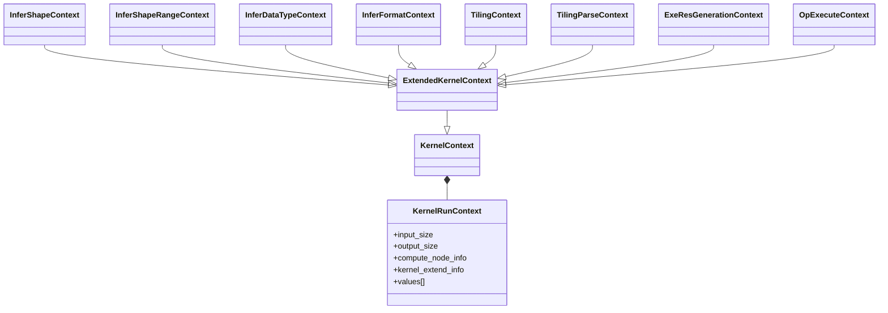
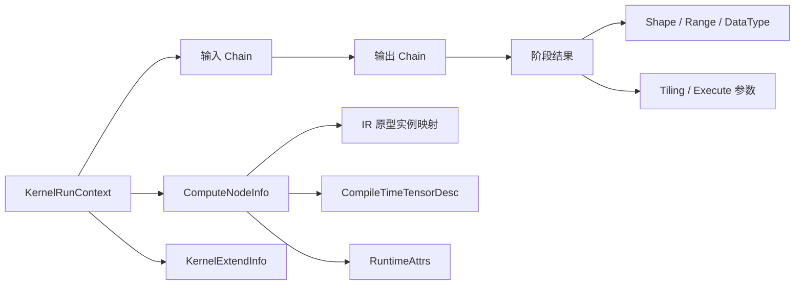
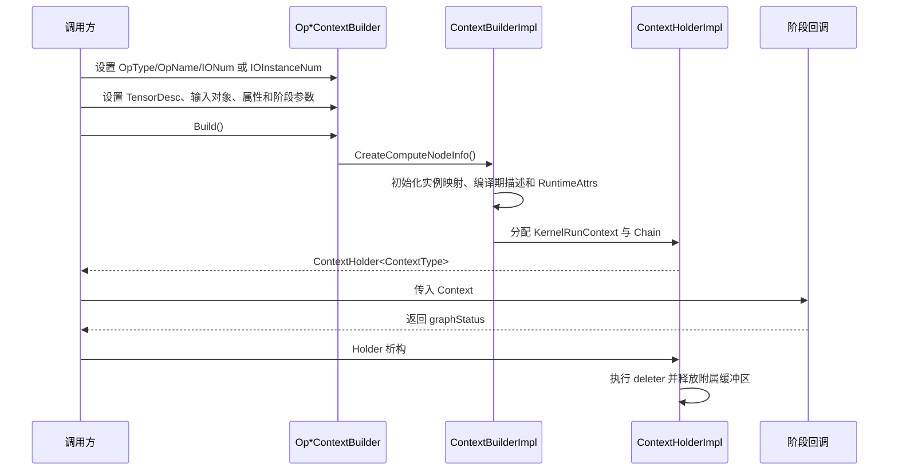
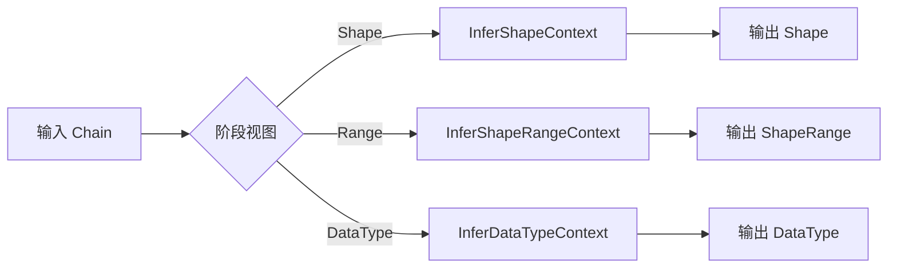
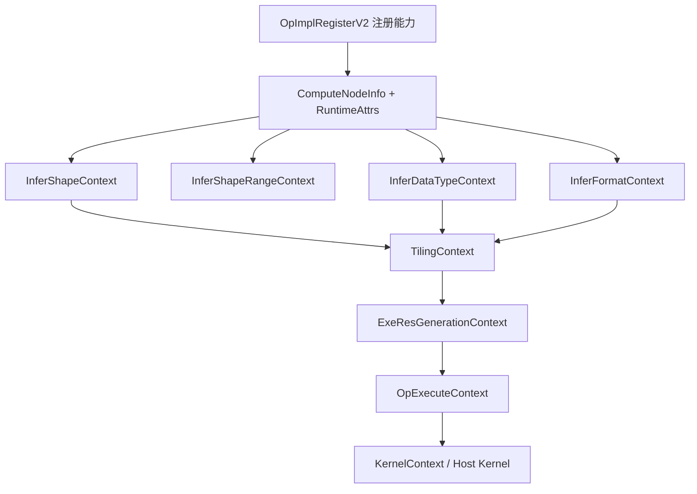

# metadef Context 体系特性分析

## 1 特性背景

### 1.1 问题域

在 CANN 图编译和算子执行链路中，一个算子会被多个阶段处理：数据类型推导、Shape 推导、Shape 范围推导、Format 推导、Tiling、执行资源生成以及 Host 侧算子执行。每个阶段都要访问节点的输入输出、属性、IR 原型和实例化信息，但阶段之间的读写对象并不相同。

如果每个阶段都定义一套独立参数结构，算子注册、GE 编译器和执行图就必须维护多套 I/O 索引、属性编码和内存生命周期协议。metadef 的 Context 体系将这些共性收敛到稳定的 `KernelRunContext`，再通过 `KernelContext`、`ExtendedKernelContext` 和阶段专用 Context 提供类型化视图。算子实现只依赖公开的 Context 接口，不需要感知 GE 内部图对象或底层槽位布局。

### 1.2 设计目标

Context 体系围绕以下目标构建：

- **统一回调边界**：不同阶段的算子函数通过 `ContextType *` 接收输入，注册接口和执行器可以复用同一套调用约定。
- **同时支持两种索引**：普通接口按实例化后的扁平索引访问；Required、Optional、Dynamic 接口按 IR 原型索引和相对实例索引访问。
- **分离节点元数据与阶段数据**：`ComputeNodeInfo` 描述算子原型和实例映射，Tensor、Shape、Range、TilingData 等阶段数据通过 Chain 槽位传递。
- **降低热路径成本**：小对象以内嵌值保存，大对象只传递指针；Context 访问主要由边界检查、索引换算和一次解引用组成。
- **保持布局稳定**：公共结构采用标准布局，版本化 Tensor 通过尾部字段承载 View 信息。

### 1.3 设计哲学

Context 的设计可以归纳为“稳定的 C 兼容/标准布局底座、类型化的阶段视图、外置的所有权协议”：

- `KernelRunContext` 和 `AsyncAnyValue` 只承担跨模块传递所需的固定布局，阶段语义由 C++ Context 视图解释。
- 普通实例索引与 IR 原型索引分离，动态输入/输出通过 `AnchorInstanceInfo` 做一次映射，不在每个阶段重复维护。
- Context 不复制 Tensor、Shape 和平台对象；调用方通过 Chain 传递指针，Holder 只回收明确安装了 deleter 的对象。
- ABI 稳定性优先于对象封装。新增字段通常放在扩展区或通过版本字段表达，避免改变公共结构的头部布局。

### 1.4 Context 总览

Context 的职责可以概括为“同一节点、不同阶段、不同视图”：

| 阶段 | Context | 主要输入 | 主要输出 |
|---|---|---|---|
| 数据类型推导 | `InferDataTypeContext` | 输入 DataType、节点属性 | 输出 DataType |
| Shape 推导 | `InferShapeContext` | 输入 Shape、数据依赖 Tensor | 输出 Shape |
| Shape 范围推导 | `InferShapeRangeContext` | ShapeRange、TensorRange | 输出 ShapeRange |
| Format 推导 | `InferFormatContext` | 输入 Tensor/Format/Shape | 输出 Format |
| Tiling | `TilingContext` | Shape、Tensor、CompileInfo、PlatformInfo | TilingKey、Block、TilingData、Workspace 等 |
| Tiling 解析 | `TilingParseContext` | 编译生成的 JSON、平台信息 | CompileInfo 对象 |
| 执行资源生成 | `ExeResGenerationContext` | 节点描述和执行模式 | 流、同步资源、Workspace |
| Host/aclnn 执行 | `KernelContext`、`OpExecuteContext` | Tensor、属性、Stream、执行选项 | Kernel 执行结果 |

这些 Context 不是互相独立的参数对象，而是遵循同一布局协议的阶段化视图。不同阶段通常由各自的 Builder/Holder 构造 Context；共享的是布局、索引和生命周期语义，不表示所有阶段必然复用同一块物理内存。

## 2 用户使用场景

### 2.1 图编译阶段的元数据推导

图编译器为算子创建节点信息后，根据注册表中的回调构造对应 Context。InferShape 回调读取输入 Shape 并写回输出 Shape；InferShapeRange 回调根据最小值和最大值计算动态范围；InferDataType 回调完成输入到输出的数据类型传播；InferFormat 回调更新 Tensor 的 Format 描述。

这些回调使用同一套 IR 实例映射，因此一个包含动态输入或可选输入的算子不需要为不同实例数量编写多套实现。Shape、DataType 和 Format 的具体阶段编排属于 GE 编译器，metadef 负责提供稳定的回调接口和数据访问语义。

### 2.2 Tiling 计算

Tiling 回调面向硬件执行参数计算。算子根据 `StorageShape`、DataType、Format、属性和平台编译信息选择算法分支，并将结果写入 Tiling 输出槽位：

- TilingKey 用于选择 Kernel 内部实现分支；
- SIMD、AICPU 和 SIMT Block/Grid 参数用于描述执行并行度；
- TilingData 用于保存 Kernel 所需的结构化参数；
- Workspace、动态 UB、Atomic 和调度模式用于描述运行资源和执行策略。

当 Tiling 依赖输入值时，算子通过 Tensor 接口读取数据；输入是否携带可读的 Host 地址由注册层的 Tiling 数据依赖声明和上层执行器共同决定。

### 2.3 动态输入与可选输入

Concat、变长序列、可选 Bias 等算子的 IR 原型数量与实际输入实例数量可能不同。Builder 通过 `IOInstanceNum` 描述每个 IR 原型的实例数量，`ComputeNodeInfo::AnchorInstanceInfo` 记录每个原型在扁平数组中的起点和实例数。

算子可以使用 `GetDynamicInput*(ir_index, relative_index)` 访问动态输入，使用 `GetOptionalInput*` 访问可选输入，使用 `GetRequiredInput*` 访问必选输入。未实例化的可选输入和越界相对索引返回空指针或约定的哨兵值。

### 2.4 Host Kernel 与 aclnn 执行

Host Kernel 使用 `KernelContext` 的模板接口读取输入输出槽位，通过 `ExtendedKernelContext` 获取节点名称、类型、属性和编译期 Tensor 描述。`OpExecuteContext` 在此基础上提供 Stream、执行选项、Allocator 和输出内存块等 aclnn 所需信息；`OpExecutePrepareContext` 与 `OpExecuteLaunchContext` 将准备阶段和实际下发阶段分离。

## 3 对外接口

### 3.1 KernelContext 与 ExtendedKernelContext

`KernelContext`（`inc/external/exe_graph/runtime/kernel_context.h`）提供底层槽位访问：

| 接口组 | 代表接口 | 说明 |
|---|---|---|
| 数量 | `GetInputNum`、`GetOutputNum` | 获取 Context 槽位中的输入、输出数量 |
| 槽位 | `GetInput`、`MutableInput`、`GetOutput` | 获取输入或输出 Chain |
| 值/指针 | `GetInputValue<T>`、`GetInputPointer<T>`、`GetOutputPointer<T>` | 按约定的类型读取槽位 |
| 字符串/底层 | `GetInputStrPointer`、`GetContext`、`IsInlineSize` | 读取字符串、访问 C 结构或判断类型是否以内嵌方式存储 |
| 节点信息 | `GetComputeNodeExtend`、`GetKernelExtend` | 获取节点元信息和 Kernel 元信息 |

`ExtendedKernelContext`（`inc/external/exe_graph/runtime/extended_kernel_context.h`）以 protected 方式继承 `KernelContext`，将底层槽位转换为节点级接口：

- `GetComputeNodeInfo`、`GetNodeType`、`GetNodeName` 获取节点身份；
- `GetInputDesc`、`GetOutputDesc` 获取编译期 Tensor 描述；
- `GetAttrs` 获取按顺序编码的 `RuntimeAttrs`；
- `GetIrInputInstanceInfo`、`GetIrOutputInstanceInfo` 获取 IR 到实例的映射；
- `GetDynamicInputDesc`、`GetOptionalInputDesc`、`GetRequiredInputDesc` 提供按原型索引的描述访问；
- `GetKernelName`、`GetKernelType` 获取 Kernel 标识。

派生 Context 不重复保存这些数据，只改变槽位的解释方式和可写范围。

### 3.2 InferShapeContext

头文件：`inc/external/exe_graph/runtime/infer_shape_context.h`。

| 接口 | 索引语义 | 读写方向 |
|---|---|---|
| `GetInputShape`、`GetInputTensor` | 实例化后的输入索引 | 只读 |
| `GetRequiredInputShape`、`GetRequiredInputTensor` | IR 原型索引，取相对实例 0 | 只读 |
| `GetOptionalInputShape`、`GetOptionalInputTensor` | IR 原型索引，未实例化时为空 | 只读 |
| `GetDynamicInputShape`、`GetDynamicInputTensor` | IR 原型索引 + 相对实例索引 | 只读 |
| `GetOutputShape` | 实例化后的输出索引 | 可写 |

Shape 推导接口面向算子语义维度。对于依赖输入值的推导，`GetInputTensor` 返回的 Tensor 是否带有 Host 数据地址取决于注册的 `InputsDataDependency`。

### 3.3 InferShapeRangeContext

头文件：`inc/external/exe_graph/runtime/infer_shape_range_context.h`。

`GetInputShapeRange`、`GetOptionalInputShapeRange`、`GetRequiredInputShapeRange` 和 `GetDynamicInputShapeRange` 访问 `Range<Shape>`；`GetInputTensorRange` 及其按原型索引的接口访问 `TensorRange`（`Range<Tensor>`）。`GetOutputShapeRange` 返回可写的 `Range<Shape>`，算子需要分别更新最小 Shape 和最大 Shape。

Range 只保存两个端点指针，不拥有端点对象。它适合表达动态 Shape 的上下界，也能保留数据依赖 Tensor 的描述信息。

### 3.4 InferDataTypeContext

头文件：`inc/external/exe_graph/runtime/infer_datatype_context.h`。

`GetInputDataType`、`GetOptionalInputDataType`、`GetRequiredInputDataType` 和 `GetDynamicInputDataType` 用于读取输入类型；`GetOutputDataType` 用于读取当前输出类型；`SetOutputDataType` 用于写回推导结果。输入读取失败返回 `ge::DT_UNDEFINED`，输出槽位在写回前通常为 `ge::DT_MAX`，非法输出索引返回 `ge::GRAPH_FAILED`。

### 3.5 TilingContext

头文件：`inc/external/exe_graph/runtime/tiling_context.h`。

#### 输入和平台信息

`GetInputShape`、`GetOutputShape` 返回包含 OriginShape 和 StorageShape 的 `StorageShape`；`GetInputTensor` 及 Required、Optional、Dynamic 版本返回 Tensor。`GetCompileInfo<T>`、`GetPlatformInfo`、`GetDeterministic` 和 `GetDeterministicLevel` 提供 Tiling 所需的编译信息、平台信息和确定性配置。

#### Tiling 输出

`TilingOutputIndex` 将结果固定在统一的输出槽位中：

| 槽位 | 主要接口 | 语义 |
|---:|---|---|
| 0 | `SetTilingKey`、`GetTilingKey` | Kernel 分支选择键 |
| 1 | `SetSimdNumBlocks`、`GetSimdNumBlocks` | SIMD 逻辑 Block 数；BlockDim 接口为兼容别名 |
| 2 | `SetNeedAtomic`、`NeedAtomic` | Atomic 清理标志 |
| 3 | `GetTilingData<T>`、`GetRawTilingData` | 类型化或原始 TilingData |
| 4 | `GetWorkspaceSizes`、`GetWorkspaceNum` | Workspace 大小数组 |
| 5 | `SetTilingCond`、`GetTilingCond` | 条件 Tiling 分支 |
| 6 | `SetScheduleMode`、`GetScheduleMode` | 调度模式 |
| 7 | `SetDynUBufSize`、`GetDynUBufSize` | 动态统一缓冲区大小；LocalMemory 接口为兼容别名 |
| 8 | `SetAicpuNumBlocks`、`GetAicpuNumBlocks` | 融合算子的 AICPU Block 数 |
| 9/10 | `SetSimtBlockDim`、`SetSimtGridDim` 及对应 Get 接口 | SIMT Block/Grid 三维参数 |

#### View、Stride 和 Offset

`InputIsView`、`OutputIsView` 以及 Required、Optional、Dynamic 版本通过 `TensorV2` 的版本字段判断是否携带 View 描述，并提供 `Get*Stride` 和 `Get*Offset`。V1 Tensor 不携带非连续描述时，接口返回 false、空指针或 `-1`。

### 3.6 相关阶段 Context

| Context | 头文件 | 主要能力 |
|---|---|---|
| `InferFormatContext` | `inc/external/graph/infer_format_context.h` | 读写 Tensor Format，并复用 Shape、Tensor 和 IR 实例映射 |
| `TilingParseContext` | `inc/external/exe_graph/runtime/tiling_parse_context.h` | 读取 CompiledJson、PlatformInfo，输出注册类型的 CompileInfo |
| `ExeResGenerationContext` | `inc/external/exe_graph/runtime/exe_res_generation_context.h` | 描述执行模式、附属流、同步资源和 Workspace |
| `OpCheckContext` | `inc/external/exe_graph/runtime/exe_res_generation_context.h` | 检查输入输出 Shape 和常量属性 |
| `OpExecuteContext` | `inc/external/exe_graph/runtime/op_execute_context.h` | 提供 Tensor、Stream、执行选项和内存分配信息 |
| `OpExecutePrepareContext` / `OpExecuteLaunchContext` | 对应头文件 | 将 aclnn 执行拆分为准备和下发阶段 |

### 3.7 Context Builder

`OpContextBuilderBase<T>`（`inc/external/base/context_builder/op_context_builder_base.h`）提供 `OpType`、`OpName`、`IONum`、`IOInstanceNum` 和 `AppendAttr`。阶段专用 Builder 在此基础上设置 Tensor 描述、输入对象和输出对象，并通过 `Build` 返回对应的 `ContextHolder`：

| Builder | Context | 典型配置 |
|---|---|---|
| `OpInferShapeContextBuilder` | `InferShapeContext` | 输入 Tensor、输出 TensorDesc |
| `OpInferShapeRangeContextBuilder` | `InferShapeRangeContext` | TensorRange、输出 TensorDesc |
| `OpInferDataTypeContextBuilder` | `InferDataTypeContext` | 输入/输出 TensorDesc |
| `OpTilingContextBuilder` | `TilingContext` | Tensor、CompileInfo、PlatformInfo、TilingData、Workspace、确定性和 SIMT 参数 |
| `OpKernelContextBuilder` | `KernelContext` | 通用输入输出 Chain 和 Tensor 描述 |
| `OpTilingParseContextBuilder` | `TilingParseContext` | CompiledJson、PlatformInfo、CompileInfo |

## 4 具体实现

### 4.1 分层对象模型



`KernelRunContext` 是 C 兼容的底层结构，保存输入输出数量、节点信息指针、Kernel 元信息指针和可变长度的 `values` 数组。`KernelContext` 以值成员封装该结构，`ExtendedKernelContext` 再将通用槽位提升为节点级接口。专用 Context 不增加运行时成员，因而可以沿用相同的内存起始地址和 ABI 解释方式。

### 4.2 固定头部与 ABI 布局

`inc/external/exe_graph/runtime/kernel_run_context.h` 中的固定头部顺序为：

```text
input_size
output_size
compute_node_info
kernel_extend_info
output_start       // 兼容旧执行器的输出起始指针
values[1]          // 占位的 Chain 指针，实际按变长数组使用
```

`values[]` 的元素类型是 `AsyncAnyValue *`，每个元素指向 Holder 内部的 `Chain` 对象；Chain 对象本身不嵌在 `KernelRunContext` 的尾部数组中。`GetOutput(i)` 按 `values[input_size + i]` 访问，`GetOutput2(i)` 则通过 `output_start[i]` 访问兼容路径。

公共结构的尺寸和标准布局由 `tests/ut/base/testcase/abi_compatibility_for_exe_graph_unittest.cc` 校验，典型值包括：

| 类型 | 尺寸（字节） |
|---|---:|
| `AsyncAnyValue` / `Chain` | 16 |
| `KernelRunContext` 及各阶段 Context | 48 |
| `AnchorInstanceInfo` | 48 |
| `CompileTimeTensorDesc` | 144 |
| `ComputeNodeInfo` | 88 |
| `RuntimeAttrsDef` | 48 |

这些尺寸是 ABI 兼容约束，不应在业务代码中自行扩展公共结构；新增阶段数据应放在扩展槽位或独立的扩展结构中。

### 4.3 数据布局



输入和输出在 `values` 中按构建器传入的扁平顺序排列。通用 `BuildCtx` 的规则是“input_values → output_values”，输出访问以 `input_size` 为基准；`output_start` 保留用于兼容旧执行器。具体 Context 可以把阶段所需的对象追加到 `input_values`，因此不能把某一种阶段的 `input_size` 公式当成所有 Context 的通用规则。节点描述不与 Chain 混合存放，而是由 `ComputeNodeInfo` 独立管理，便于所有阶段复用。

以 `TilingContext` 为例，输入段通常依次为：普通输入 Tensor、普通输出 Tensor、`CompileInfo`、`PlatformInfo`、PrepareTilingFrameworkData、Deterministic 和 DeterministicLevel；Tiling 结果位于独立的 output 段。InferShape Builder 则会追加 `InputExternLayout::kInferShapeFunc` 对应的隐藏输入槽位。

### 4.4 注册层与 Context 的关系

`OpImplRegisterV2`（`inc/external/register/op_impl_registry.h`）以函数指针别名注册各阶段实现：`InferShapeKernelFunc`、`InferShapeRangeKernelFunc`、`InferDataTypeKernelFunc`、`TilingKernelFunc`、`TilingParseFunc`、`OpExecFunc` 以及执行资源生成接口。注册结构同时保存输入数据依赖、Tiling 数据依赖、Tiling 放置能力、最大 TilingData 大小和输出可空属性。

注册层描述“某个算子具备哪些能力”，Context 描述“回调如何获取这些能力所需的数据”。二者通过统一的函数签名和槽位约定连接到 GE 的编译与执行流程。

## 5 核心实现

### 5.1 Chain：统一的值槽位

`Chain` 位于 `inc/external/exe_graph/runtime/kernel_context.h`，底层使用 `AsyncAnyValue` 保存一个指针大小的联合体和一个释放器。

- 不超过指针大小的值通过 `inplace` 内嵌保存，DataType 等小枚举可使用 `ge::ValueToPtr` 无额外分配传递。
- 更大的对象通过 `data.pointer` 保存地址，Tensor、Shape、Range、TilingData、Workspace 和平台信息都可采用零拷贝指针传递。
- `Set` 覆盖旧值前调用旧 deleter；`SetWithDefaultDeleter` 为单对象或数组安装默认释放器；空 deleter 表示借用外部对象。

这种设计把标量热路径和复杂对象传递统一到同一组槽位中，保持连续布局、低分配次数和跨 C/C++ 边界的稳定性。

需要区分存储机制和编码约定：`Chain::Set(void *, deleter)` 本身只是写入指针和 deleter，并不会根据类型大小自动把对象转换为内嵌值。小标量通常由 Builder 使用 `ValueToPtr` 编码，或由调用方通过 `GetPointer<T>()` 写入 `inplace`；大对象则保存外部地址。

### 5.2 ComputeNodeInfo：IR 原型到实例的桥梁

`ComputeNodeInfo`（`inc/external/exe_graph/runtime/compute_node_info.h`）使用连续内存保存输入/输出 IR 原型信息、实例化描述和属性缓冲区，主要组成包括：

1. `AnchorInstanceInfo`：记录一个 IR 输入或输出原型的实例起点和实例数量；
2. `CompileTimeTensorDesc`：记录 DataType、Origin/Storage Format、ExpandDimsType 和输出存在性；
3. `RuntimeAttrs`：通过偏移表定位按 IR 原型顺序序列化的属性；
4. 节点名称和类型指针：指向 `ContextHolderImpl::string_pool_` 中的字符串，供调试、日志和 Kernel 识别使用；字符串本身不在 `ComputeNodeInfo` 变长区内。

其变长区按访问偏移排列为：

```text
ComputeNodeInfo 固定头部
→ 输入 AnchorInstanceInfo[]
→ 输入 CompileTimeTensorDesc[]
→ 输出 CompileTimeTensorDesc[]
→ RuntimeAttrs 字节区
→ 输出 AnchorInstanceInfo[]
```

`ExtendedKernelContext::GetDynamicInputPointer` 和 `GetDynamicOutputPointer` 使用 `AnchorInstanceInfo` 完成 IR 索引到扁平槽位的换算。所有专用 Context 因此共享同一套动态输入寻址逻辑，而无需各自维护映射表。

两套索引的含义必须区分：普通 `GetInput*(i)` / `GetOutput*(i)` 使用实例化后的扁平 index；`GetRequired*`、`GetOptional*` 和 `GetDynamic*(ir_index, relative_index)` 使用 REG_OP 声明顺序中的 IR index。比如动态输入 `dyn` 的映射为 `{start=2, num=3}` 时，`GetDynamicInputTensor(dyn_ir_index, 1)` 访问扁平输入 3，而不是 IR index 3。

输出侧也遵循同样规则：`AnchorInstanceInfo` 的 `instance_start` 是输出段内的相对位置，最终按 `input_num + start + relative_index` 计算扁平偏移（部分内部实现通过 `GetInputPointer` 访问该偏移）；它不会与 IR index 混用。

### 5.3 RuntimeAttrs：按 IR 顺序编码的属性

`RuntimeAttrs` 是 `ComputeNodeInfo` 内部的一段紧凑 buffer，头部为 `RuntimeAttrsDef`（属性数量、保留字段和 offset 表），不保存属性名，也不负责类型校验。`GetInt(i)`、`GetFloat(i)`、`GetBool(i)` 等接口依据 offset 返回对应 payload，调用方必须按 IR attr 顺序和注册时的类型读取。

通过 GE 的 `OpDesc` 构建路径时，进入该 buffer 的通常是 `GetIrAttrNames()` 指定的属性，随后可能追加注册层的 private attrs；普通 `GetAllAttrs()` 中未列入 IR attr 名称的属性不会自动出现在 `RuntimeAttrs` 中。通过 metadef 的手工 Builder 构建时，则以 `AppendAttr` 的追加顺序为准。两条路径应在文档中明确区分。

### 5.4 Builder：从节点描述装配 Context



`ContextBuilderImpl::CreateComputeNodeInfo`（实现位于 `base/context_builder/op_context_builder_impl.cc`）根据 IR 原型数量、实例数量和属性大小计算连续内存，初始化 `AnchorInstanceInfo`、`CompileTimeTensorDesc`、`RuntimeAttrs` 及节点字符串。`BuildCtx` 再为 `KernelRunContext` 和 Chain 数组分配空间，将输入输出对象及其 deleter 写入槽位。

阶段专用 Builder 的装配方式体现了各 Context 的数据边界：

- InferShape Builder 保存输入 `Tensor*`，为输出创建可写 `Shape`；运行期专用的 `InputExternLayout` 槽位可承载 InferShape 函数或资源类算子的推导上下文。
- InferShapeRange Builder 保存 `Range<Tensor>*`，为每个输出创建 `Range<Shape>` 及其端点，并检查输入范围两端的描述一致性。
- InferDataType Builder 将输入 DataType 以内嵌值写入 Chain，输出初始化为 `ge::DT_MAX`。
- Tiling Builder 将输入/输出 Tensor、CompileInfo、PlatformInfo、确定性字段和 Tiling 输出槽位组合为一个完整的 TilingContext。

`ContextHolder` 以 `unique_ptr` 持有 Context、Chain、ComputeNodeInfo 和字符串池。通过指针传入的 Tensor、Range、CompileInfo、PlatformInfo 和 Workspace 默认由调用方管理；由 Builder 创建的 Shape、Range 和 `TilingDataSize` 缓冲区由 Holder 回收。

构建时应满足以下约束：

- `CreateComputeNodeInfo` 要求算子类型、算子名称以及 IR 输入/输出数量有效；Tiling Builder 还要求 `CompileInfo` 和 `PlatformInfo` 非空。
- `IOInstanceNum` 决定 `AnchorInstanceInfo` 中的 `{instance_start, instantiation_num}`，属性序列化顺序由 `AppendAttr` 的追加顺序决定。
- Builder 产物返回空 Holder 时，调用方不能继续访问 Context；回调结束前必须保持 Holder 存活。
- Chain 覆盖旧值时会先执行旧 deleter；Holder 析构时遍历 Chain，释放拥有所有权的对象。借用对象必须使用空 deleter，避免重复释放。

### 5.4.1 各阶段的扩展槽位

阶段 Context 复用同一个 `BuildCtx`，但扩展输入和输出数量不同，设计文档应把这些槽位视为阶段契约：

| 阶段 | 扩展输入 | 输出结果 |
|---|---|---|
| InferShape | `InputExternLayout::kInferShapeFunc`（运行期推导函数）或 `kInferenceContext`（资源算子编译期上下文） | 输出 `Shape` |
| InferShapeRange | 输入 `Range<Tensor>` | 输出 `Range<Shape>` |
| InferDataType | 输入 DataType 内嵌值 | 输出 DataType，初始值通常为 `DT_MAX` |
| Tiling | `CompileInfo`、`PlatformInfo`、PrepareTilingFrameworkData、确定性标志和等级 | TilingKey、并行度、TilingData、Workspace 等固定槽位 |
| OpExecute | ExecuteOption、Stream、FwkData、执行函数等扩展信息 | 参数、Workspace 地址/大小和 BlockMemory |

其中 Tiling 的输出索引为 0～10，`kTilingStatus` 位于 `kOutputNum` 之后，用于可失败 Tiling 接口。`BlockDim`、`LocalMemorySize` 和 `AicpuBlockDim` 是兼容别名，新增代码应优先使用 SIMD、动态 UB 和 AICPU Block 数接口。

### 5.5 推导 Context：语义元数据的原地写回

InferShape、InferShapeRange 和 InferDataType 共享节点元数据，但对 Chain 使用不同的类型解释：



InferShape Builder 的输入槽位保存 Tensor 指针，`InferShapeContext::GetInputShape` 利用标准布局读取其中的 OriginShape 视图；InferShapeRange Builder 则利用 `Range<T>` 的双指针布局读取 TensorRange 的 Shape 端点。这种方式避免复制大对象，使推导结果可以直接写回输出槽位。

InferDataType 的输入和输出是指针大小的枚举值，可以直接以内嵌值读写，不需要为每个 DataType 分配独立对象。三类 Context 均通过 `GetDynamicInputPointer` 复用 IR 原型到实例的映射。

### 5.6 TilingContext：面向硬件执行的参数视图

TilingContext 在 ExtendedKernelContext 的基础上，将输入 Tensor、双 Shape/Format、平台编译信息和 Tiling 输出连接起来。

`StorageShape` 同时保存 OriginShape 和 StorageShape：OriginShape 保留算子语义，StorageShape 表示考虑硬件布局和对齐后的执行形态。`StorageFormat` 同时保存原始格式、运行时格式和补维规则。Tiling 通常根据 StorageShape 和 StorageFormat 规划访存与分块，而算子语义判断仍可使用 Origin 视图。

`Tensor` 携带 Shape、Format、DataType、地址和 TensorPlacement；`TensorV2` 在 V1 Tensor 布局后增加 Stride、Offset 和版本信息。TilingContext 通过版本判断是否提供 View 描述，从而在保留 V1 兼容性的同时支持非连续 Tensor。

`GetTilingData<T>` 对容量进行检查后返回类型化缓冲区；`GetWorkspaceSizes` 通过 `TypedContinuousVector<size_t>` 管理 Workspace 数组；TilingKey、Block 数、Atomic、调度模式等标量结果可直接写入 Chain 槽位，TilingData、Workspace 和 SIMT Dim 则通过外部对象指针传递。

Tiling 查询接口在槽位不存在或参数非法时返回约定哨兵值，例如 TilingKey 返回最大 `uint64_t`，SIMD/AICPU Block 数和动态 UB 大小返回最大 `uint32_t`，TilingCond 返回 `-1`。调用方应先检查返回值或指针，再使用 TilingData 和 Workspace；`GetTilingData<T>` 还会根据容量设置实际数据大小。

### 5.7 执行期 Context：把编译结果交给运行时

`ExeResGenerationContext` 面向任务生成阶段，提供静态/动态执行模式、附属流、同步资源、Workspace、算子 ID 和属性的读写接口；`OpCheckContext` 可在该阶段检查输入输出 Shape 及常量属性。`TilingParseContext` 将编译生成的 JSON 和平台信息转换为注册类型的 CompileInfo。

`OpExecuteContext`、`OpExecutePrepareContext` 和 `OpExecuteLaunchContext` 将 aclnn 执行拆成两个阶段：

```text
Prepare：ExecuteOption / FwkData / Stream
       → OpApiParams、WorkspaceSizes

Launch ：OpApiParams / WorkspaceAddrs / WorkspaceSizes / Stream / FwkData
       → 实际算子下发
```

Prepare 阶段通过 `SetOpApiParams`（或带默认 deleter 的版本）保存参数，Launch 阶段读取参数和 Workspace 地址；若参数由外部管理，必须显式约定 deleter 和存活期。

这些 Context 不重新定义节点信息，而是复用 `ComputeNodeInfo`、`RuntimeAttrs` 和 IR 实例映射。编译阶段生成的描述因此可以沿着同一 Context 契约传递到执行阶段。

## 6 Context 协作关系



这条链路体现了 Context 体系的分工：推导 Context 负责形成可解释的节点元数据，TilingContext 将元数据转换为硬件执行参数，执行期 Context 再把这些参数组织成任务资源和 Kernel 调用输入。每个阶段只暴露自身需要的读写接口，同时共享底层节点描述和实例寻址规则。

Context 体系的核心价值不在于增加更多参数，而在于把跨仓协作中的槽位布局、IR 实例映射和对象生命周期收敛为统一语义。GE、算子仓和执行图由此能够在不暴露内部实现的前提下共享同一数据通路。
